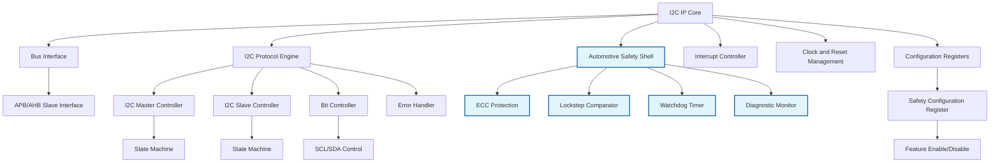
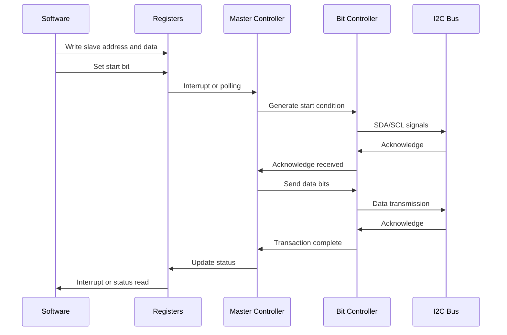
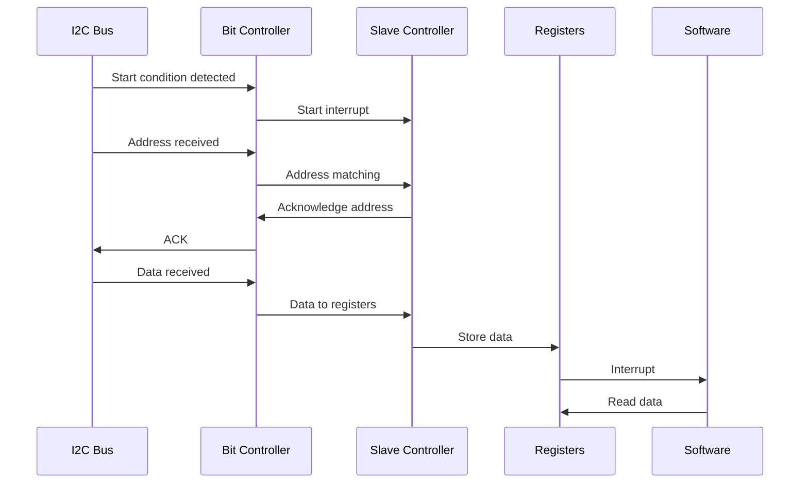

# 2. Architecture Overview

## 2.1 High-Level Architecture

The I2C IP core is organized as a modular design with clear separation between protocol logic, bus interface, and configuration management. The architecture is designed to be synthesizable on both FPGA and ASIC technologies while maintaining automotive-grade reliability.



## 2.2 Module Descriptions

### 2.2.1 Bus Interface Module
- **Function**: Provides the interface to the system bus (APB or AHB)
- **Responsibilities**:
  - Register read/write operations
  - Address decoding
  - Data buffering
- **Key Features**:
  - Support for both APB 3.0 and AHB-Lite
  - Configurable data width (32-bit default)
  - Burst transfer support

### 2.2.2 I2C Protocol Engine
- **Function**: Implements the core I2C protocol logic
- **Sub-modules**:
  - **I2C Master Controller**: Handles master mode operations
  - **I2C Slave Controller**: Handles slave mode operations
  - **Bit Controller**: Manages bit-level timing and SDA/SCL control
  - **Error Handler**: Detects and reports protocol errors

### 2.2.3 Configuration Registers
- **Function**: Stores configuration parameters and status information
- **Types**:
  - Control registers for mode selection and timing
  - Status registers for error reporting and state indication
  - Data registers for transmit/receive buffers

### 2.2.4 Interrupt Controller
- **Function**: Manages interrupt generation and masking
- **Features**:
  - Configurable interrupt sources
  - Priority-based interrupt handling
  - Maskable interrupts

### 2.2.5 Clock and Reset Management
- **Function**: Handles clock domain crossing and reset synchronization
- **Features**:
  - Clock gating for power management
  - Reset synchronization across clock domains
  - Glitch-free clock switching

## 2.3 Data Flow

### 2.3.1 Master Mode Data Flow



### 2.3.2 Slave Mode Data Flow



## 2.4 Clock Domains

The IP core operates in multiple clock domains:

1. **System Clock Domain**: For bus interface and register access
2. **I2C Clock Domain**: Derived from system clock for SCL generation
3. **Async Reset Domain**: For reset synchronization

Clock domain crossing is handled through proper synchronization techniques to prevent metastability.

## 2.5 Power Management

The IP supports multiple power states:

- **Active**: Full functionality
- **Idle**: Clock gating when not in use
- **Sleep**: Minimal power consumption with wake-up capability
- **Off**: Complete power down (external control)

## 2.6 Configuration Options

The IP is highly configurable through Verilog parameters:

- **Bus Width**: 8, 16, 32-bit data bus
- **FIFO Depth**: Configurable transmit/receive buffer sizes
- **Mode Selection**: Master-only, slave-only, or dual mode
- **Safety Features**: Enable/disable automotive safety mechanisms
- **Interrupt Count**: Number of interrupt lines

### 2.6.1 Automotive Configuration Parameters

```verilog
// Synthesis-time parameters for automotive features
parameter AUTOMOTIVE_MODE = 1,        // 1=Automotive, 0=General-purpose
parameter SAFETY_LEVEL = "ASIL_B",    // ASIL_A, ASIL_B, ASIL_C, ASIL_D
parameter REDUNDANCY_EN = 1,          // Enable redundant processing
parameter ECC_EN = 1,                 // Enable error-correcting codes
parameter PARITY_EN = 1,              // Enable parity checking
parameter WATCHDOG_EN = 1,            // Enable watchdog timer
parameter LOCKSTEP_EN = 1,            // Enable lockstep operation
parameter DIAGNOSTIC_EN = 1,          // Enable diagnostic features
parameter FAULT_INJECTION_EN = 0      // Enable fault injection for testing
```

### 2.6.2 Runtime Configuration

The SAFETY register provides runtime control of automotive features:

- **Bit 7**: REDUNDANCY_EN - Enable/disable redundant channels
- **Bit 6**: WATCHDOG_EN - Enable/disable watchdog timer
- **Bit 5**: CRC_EN - Enable/disable CRC checking
- **Bit 4**: PARITY_EN - Enable/disable parity checking
- **Bit 3**: LOCKSTEP_EN - Enable/disable lockstep operation
- **Bit 2**: ECC_EN - Enable/disable error correction
- **Bit 1**: FSM_CHECK_EN - Enable/disable FSM checking
- **Bit 0**: SAFETY_MODE - Global safety mode enable

---

[Previous: Overview](./overview.md) | [Next: Interfaces](./interfaces.md)