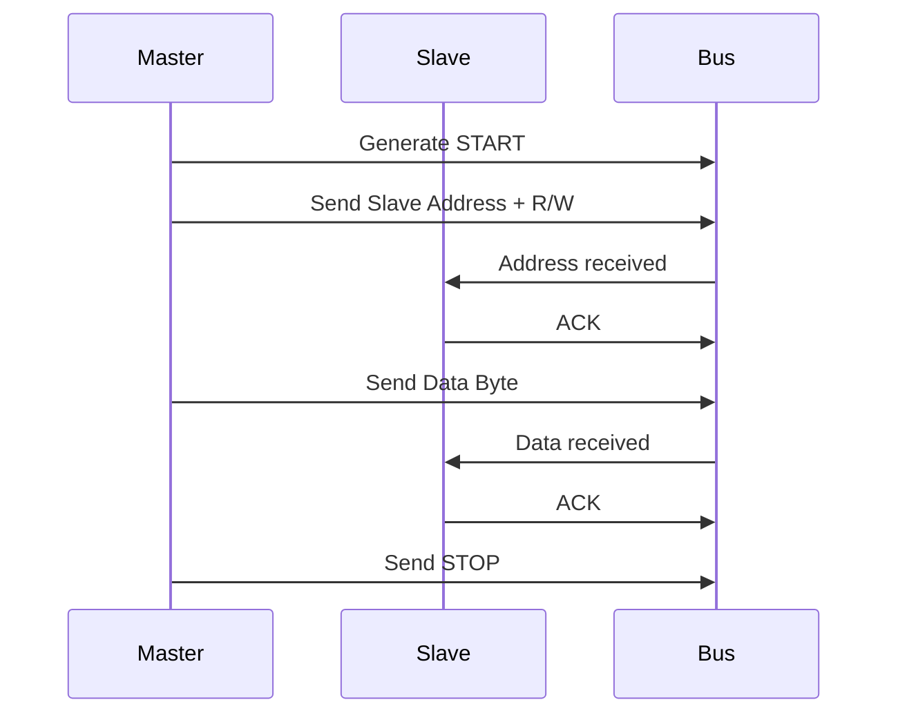

# 5. Micro-Architecture

## 5.1 State Machines

### 5.1.0 Multi-Master Arbitration

The IP core supports multi-master operation with sophisticated arbitration mechanisms:

- **Bus Arbitration**: Monitors SDA during transmission; releases bus if another master takes control
- **Arbitration Lost Detection**: Immediate detection and clean bus release
- **Clock Synchronization**: Synchronizes SCL with other masters using wired-AND logic
- **Clock Stretching**: Handles slave-initiated clock stretching for slow operations
- **Arbitration Recovery**: Automatic retry mechanism after arbitration loss

```verilog
// Arbitration detection logic
always @(posedge scl) begin
    if (sda_out != sda_in) begin
        arbitration_lost <= 1;
        // Release bus control
        sda_dir <= 0;
        state <= ARB_LOST;
    end
end
```

### 5.1.1 Master Controller State Machine

The master controller implements the I2C master protocol using a finite state machine (FSM).

```verilog
typedef enum logic [3:0] {
    IDLE        = 4'b0000,
    START       = 4'b0001,
    SEND_ADDR   = 4'b0010,
    SEND_DATA   = 4'b0011,
    RECEIVE_ACK = 4'b0100,
    RECEIVE_DATA= 4'b0101,
    SEND_ACK    = 4'b0110,
    STOP        = 4'b0111,
    ARB_LOST    = 4'b1000,
    ERROR       = 4'b1001
} master_state_t;
```

#### State Descriptions

| State | Description | Next States |
|-------|-------------|-------------|
| `IDLE` | Waiting for transaction start | `START` |
| `START` | Generating start condition | `SEND_ADDR` |
| `SEND_ADDR` | Transmitting slave address | `RECEIVE_ACK`, `ARB_LOST` |
| `SEND_DATA` | Transmitting data byte | `RECEIVE_ACK`, `ARB_LOST` |
| `RECEIVE_ACK` | Waiting for acknowledge | `SEND_DATA`, `RECEIVE_DATA`, `STOP`, `ERROR` |
| `RECEIVE_DATA` | Receiving data byte | `SEND_ACK`, `ARB_LOST` |
| `SEND_ACK` | Sending acknowledge | `RECEIVE_DATA`, `STOP` |
| `STOP` | Generating stop condition | `IDLE` |
| `ARB_LOST` | Arbitration lost handling | `IDLE` |
| `ERROR` | Error state | `IDLE` |

### 5.1.2 Slave Controller State Machine

The slave controller handles incoming I2C transactions.

```verilog
typedef enum logic [2:0] {
    SLAVE_IDLE     = 3'b000,
    SLAVE_ADDR     = 3'b001,
    SLAVE_DATA_RX  = 3'b010,
    SLAVE_DATA_TX  = 3'b011,
    SLAVE_ACK      = 3'b100,
    SLAVE_NACK     = 3'b101
} slave_state_t;
```

### 5.1.3 Bit Controller State Machine

The bit controller manages the low-level SDA and SCL signaling.

```verilog
typedef enum logic [2:0] {
    BIT_IDLE   = 3'b000,
    BIT_START  = 3'b001,
    BIT_DATA   = 3'b010,
    BIT_ACK    = 3'b011,
    BIT_STOP   = 3'b100
} bit_state_t;
```

## 5.2 Timing Diagrams

### 5.2.1 I2C Standard Mode Timing

```
SCL:  ____/‾‾‾‾\____/‾‾‾‾\____/‾‾‾‾\____
SDA:  XXXXXXXX|START| A6 A5 A4 A3 A2 A1 A0 R/W | ACK | D7 D6 D5 D4 D3 D2 D1 D0 | ACK |STOP|XXXXXXXX

     |<-- t_HD;STA -->|<-- t_LOW -->|<-- t_HIGH -->|<-- t_SU;STA -->|
```

#### Timing Parameters

| Parameter | Description | Min | Max |
|-----------|-------------|-----|-----|
| `t_HD;STA` | Start condition hold time | 4.0 μs | - |
| `t_LOW` | SCL low period | 4.7 μs | - |
| `t_HIGH` | SCL high period | 4.0 μs | - |
| `t_SU;STA` | Start condition setup time | 4.7 μs | - |
| `t_HD;DAT` | Data hold time | 0 μs | 3.45 μs |
| `t_SU;DAT` | Data setup time | 250 ns | - |
| `t_SU;STO` | Stop condition setup time | 4.0 μs | - |
| `t_BUF` | Bus free time | 4.7 μs | - |

### 5.2.2 Fast Mode Timing

```
SCL:  ____/‾‾\____/‾‾\____/‾‾\____
SDA:  XXXXXXXX|START| ... |STOP|XXXXXXXX

     |<-- 1.3 μs -->|<-- 0.6 μs -->|
```

### 5.2.3 Master Transaction Sequence



## 5.3 Error Handling

### 5.3.1 Bus Error Detection

The IP core detects various bus errors:

1. **Arbitration Lost**: When another master takes control
2. **No Acknowledge**: Slave doesn't respond
3. **Bus Stuck**: SCL or SDA stuck at low
4. **Timeout**: Transaction takes too long

### 5.3.2 Error Recovery Mechanisms

```verilog
always @(posedge clk or negedge rst_n) begin
    if (!rst_n) begin
        error_state <= NO_ERROR;
    end else begin
        case (error_state)
            NO_ERROR: begin
                if (arb_lost) error_state <= ARB_ERROR;
                else if (no_ack) error_state <= ACK_ERROR;
                else if (bus_stuck) error_state <= BUS_ERROR;
            end
            ARB_ERROR: begin
                // Recovery: Release bus, wait for free
                if (bus_free) error_state <= NO_ERROR;
            end
            ACK_ERROR: begin
                // Recovery: Retry or abort transaction
                if (retry_count < MAX_RETRY) begin
                    retry_count <= retry_count + 1;
                    error_state <= NO_ERROR;
                end else begin
                    error_state <= FATAL_ERROR;
                end
            end
            BUS_ERROR: begin
                // Recovery: Force stop condition
                force_stop <= 1;
                error_state <= NO_ERROR;
            end
            FATAL_ERROR: begin
                // Require software intervention
            end
        endcase
    end
end
```

### 5.3.3 Safety Mechanisms

For automotive applications, additional safety features are implemented:

- **Dual-Core Lockstep**: Redundant processing with comparison
- **ECC Protection**: Error-correcting codes for memories
- **Watchdog Timer**: Monitors for hangs and resets
- **Parity Checking**: For data integrity

## 5.4 FIFO Implementation

### 5.4.1 FIFO Architecture

```verilog
module fifo #(
    parameter DEPTH = 16,
    parameter WIDTH = 8
)(
    input clk,
    input rst_n,
    input wr_en,
    input rd_en,
    input [WIDTH-1:0] wr_data,
    output [WIDTH-1:0] rd_data,
    output full,
    output empty,
    output [4:0] level
);

// FIFO implementation with pointers
reg [WIDTH-1:0] mem [0:DEPTH-1];
reg [3:0] wr_ptr, rd_ptr;
reg [4:0] count;

assign full = (count == DEPTH);
assign empty = (count == 0);
assign level = count;

always @(posedge clk or negedge rst_n) begin
    if (!rst_n) begin
        wr_ptr <= 0;
        rd_ptr <= 0;
        count <= 0;
    end else begin
        if (wr_en && !full) begin
            mem[wr_ptr] <= wr_data;
            wr_ptr <= wr_ptr + 1;
            count <= count + 1;
        end
        if (rd_en && !empty) begin
            rd_data <= mem[rd_ptr];
            rd_ptr <= rd_ptr + 1;
            count <= count + 1;
        end
    end
end
endmodule
```

### 5.4.2 FIFO Threshold Interrupts

The FIFO generates interrupts based on configurable thresholds:

- **TX Threshold**: Interrupt when TX FIFO level falls below threshold
- **RX Threshold**: Interrupt when RX FIFO level exceeds threshold
- **Empty/Full**: Interrupts for FIFO empty/full conditions

## 5.5 Clock Domain Crossing

### 5.5.1 CDC Strategy

The IP handles multiple clock domains:

1. **System Clock**: For APB/AHB interface
2. **I2C Clock**: For SCL generation
3. **Async Reset**: For reset synchronization

### 5.5.2 Synchronization Techniques

```verilog
// Two-stage synchronizer for single-bit signals
module sync_2ff (
    input clk,
    input rst_n,
    input d_in,
    output d_out
);

reg sync1, sync2;

always @(posedge clk or negedge rst_n) begin
    if (!rst_n) begin
        sync1 <= 0;
        sync2 <= 0;
    end else begin
        sync1 <= d_in;
        sync2 <= sync1;
    end
end

assign d_out = sync2;
endmodule
```

### 5.5.3 Handshake Protocol

For multi-bit data transfer between domains:

```verilog
module cdc_handshake (
    input clk_a,
    input clk_b,
    input rst_n,
    input [31:0] data_a,
    input req_a,
    output ack_a,
    output [31:0] data_b,
    output req_b,
    input ack_b
);

// Implementation of handshake protocol
endmodule
```

## 5.6 Power Management

### 5.6.1 Power States

1. **Active**: Full functionality
2. **Idle**: Clock gating, reduced power
3. **Sleep**: Minimal retention, wake-up capability
4. **Off**: Complete power down

### 5.6.2 Clock Gating

```verilog
module clock_gater (
    input clk,
    input en,
    input rst_n,
    output clk_gated
);

reg en_sync;

always @(posedge clk or negedge rst_n) begin
    if (!rst_n) begin
        en_sync <= 0;
    end else begin
        en_sync <= en;
    end
end

assign clk_gated = clk & en_sync;
endmodule
```

### 5.6.3 Power Gating

For ultra-low power applications, power gating cells are used to completely shut down unused sections.

---

[Previous: Register Map](./register_map.md) | [Next: Functional Safety](./functional_safety.md)